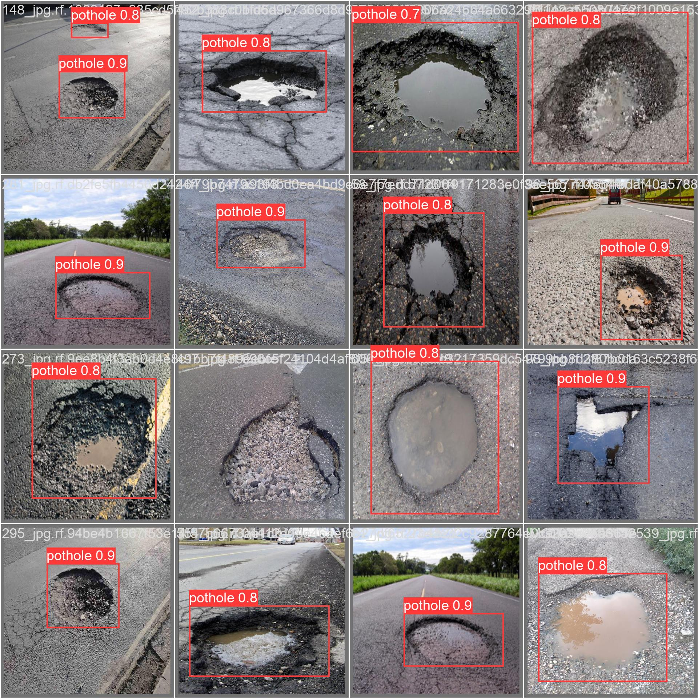

<div align="center">

# 🕳️ Road Pothole Detection
### Comparative Evaluation of YOLO Variants for Intelligent Road Infrastructure Monitoring

<p align="center">
  
  
  
  
</p>

<p align="center">
  <b>A systematic comparison of YOLOv5m, YOLOv8m, and YOLOv11n for real-time pothole detection<br/>
  across public benchmark and custom mountain terrain datasets from Himachal Pradesh, India.</b>
</p>

---

</div>

## 🎯 The Problem

Potholes are among the most common and hazardous road surface defects, causing vehicle damage, accidents, and traffic disruptions. Manual detection methods are time-consuming and impractical at scale. Automated, real-time pothole detection using deep learning provides a practical solution for smart road infrastructure monitoring.

This project evaluates three state-of-the-art YOLO architectures under identical training conditions to determine which model best balances detection accuracy, generalization, and inference efficiency for real-world deployment.

---

## 📦 Datasets

### Dataset 1 — Public Pothole Dataset
- **Source:** Roboflow Universe — publicly available benchmark dataset
- **Size:** 665 images (Train: 465 | Valid: 133 | Test: 67)
- **Annotations:** 1,740 bounding box annotations
- **Conditions:** Varied lighting, weather, and road surface conditions

### Dataset 2 — Custom Mountain Terrain Dataset (Pothole08)
- **Source:** Manually collected from mountain roads of Himachal Pradesh, India
- **Size:** 416 images (Train: 360 | Valid: 28 | Test: 28)
- **Annotations:** 616 bounding box annotations
- **Pipeline:** Annotated and augmented via Roboflow — rotation, grayscaling, shear, cropping, flipping
- **Significance:** Represents challenging real-world mountain road conditions not covered by existing public datasets

> The custom dataset was specifically built to evaluate model robustness on terrain conditions typical of hilly Indian roads — a scenario underrepresented in existing pothole detection research.

---

## 🧠 Models Compared

| Model | Architecture | Parameters | Inference Speed |
|-------|-------------|------------|-----------------|
| **YOLOv5m** | CSPDarknet53 + PANet, anchor-based | 7.1M | ~22ms/image |
| **YOLOv8m** | C2f blocks, anchor-free, DFL loss | 25.8M | ~12ms/image |
| **YOLOv11n** | C3K2 + C2PSA attention, anchor-free | 2.6M | ~8ms/image |

All models trained with:
- Image size: 640×640
- Epochs: 50
- Batch size: 16
- Pretrained COCO weights
- Google Colab T4 GPU

---

## 📊 Results

### Custom Mountain Terrain Dataset

| Model | mAP@0.5 | mAP@0.5:0.95 | Precision | Recall |
|-------|---------|--------------|-----------|--------|
| YOLOv5m | 0.9873 | — | 1.0000 | 0.9604 |
| YOLOv8m | 0.9406 | 0.5003 | 0.8658 | 0.8462 |
| **YOLOv11n** | **0.9799** | **0.5770** | **0.9425** | **0.9231** |

### Public Benchmark Dataset

| Model | mAP@0.5 | mAP@0.5:0.95 | Precision | Recall |
|-------|---------|--------------|-----------|--------|
| YOLOv5m | 0.7941 | — | 0.8476 | 0.7151 |
| YOLOv8m | 0.7781 | 0.4925 | 0.8325 | 0.6515 |
| **YOLOv11n** | **0.7807** | **0.5054** | 0.8233 | **0.6879** |

### Key Observations

- **YOLOv11n achieves the best accuracy-efficiency tradeoff** — near-identical mAP to YOLOv5m with 63% fewer parameters and 3x faster inference
- **YOLOv11n leads on the public dataset** — strongest generalization to unseen road conditions
- **All models exceed 97% mAP on the custom mountain terrain dataset** — validating robustness on real Indian road conditions
- **YOLOv11n inference at 8ms/image** makes it suitable for real-time dashcam and edge deployment

---

## 🖼️ Detection Samples

> Pothole detections on custom mountain terrain test images

<!-- Add detection sample images here after training -->


---

## 🌐 Web Interface

A Flask-based web application for real-time pothole detection is included — designed for mobile use, allowing direct camera capture and instant detection.

**Features:**
- 📸 Direct phone camera capture or gallery upload
- 🎚️ Adjustable confidence threshold
- ⚡ Real-time detection with bounding boxes
- 📊 Per-detection confidence scores
- 🕒 Inference time display

**Setup:**
```bash
pip install flask ultralytics pillow opencv-python
mkdir models
# Copy your best trained model weights to models/best.pt
python pothole_detector_app.py
```

Open the Network URL displayed on your phone browser — works on any device on the same WiFi.

---

## 🗂️ Repository Structure

```
pothole-detection/
│
├── notebooks/
│   ├── yolov5_pothole_detection.ipynb
│   ├── yolov8_pothole_detection.ipynb
│   └── yolov11_pothole_detection.ipynb
│
├── pothole_detector_app.py       # Flask web interface
├── requirements.txt
└── README.md
```

---

## 🚀 How to Run

### Training

Open any notebook in Google Colab with GPU runtime and run all cells. Each notebook handles:
- Dataset download from Roboflow
- EDA and dataset statistics
- Model training on both datasets
- Evaluation and results visualization
- W&B experiment tracking

### Inference Interface

```bash
git clone https://github.com/ArpitAwasthi2411/pothole-detection
cd pothole-detection
pip install -r requirements.txt
python pothole_detector_app.py
```

---

## 📋 Requirements

```
ultralytics>=8.0.0
flask>=2.0.0
roboflow>=1.0.0
wandb>=0.15.0
opencv-python>=4.8.0
pillow>=9.0.0
matplotlib>=3.7.0
pandas>=2.0.0
numpy>=1.24.0
```

---

## 📄 Research Publication

This work is associated with a research paper published at the **IEEE OCIT Conference 2025**:

**"Performance Evaluation of YOLO Variants for Road Pothole Detection"**
First Author: Arpit Awasthi | Government Hydro Engineering College, Bilaspur
[DOI: 10.1109/11400404](https://ieeexplore.ieee.org/document/11400404)

> Note: The results in this repository are from independent reimplementation runs. Minor variations from published results are expected due to different random seeds and training conditions. Trends and conclusions remain consistent.

---

## 👤 Author

**Arpit Awasthi**
B.Tech CSE (AI & DS) | Government Hydro Engineering College, Bilaspur
BS Data Science & Applications | IIT Madras
GATE 2026 AIR 430 (DS&AI)

[](https://github.com/ArpitAwasthi2411)
[](https://linkedin.com/in/arpit-awasthi-196974212)

---

<div align="center">
Built for smarter road infrastructure · Himachal Pradesh, India 🏔️
</div>
